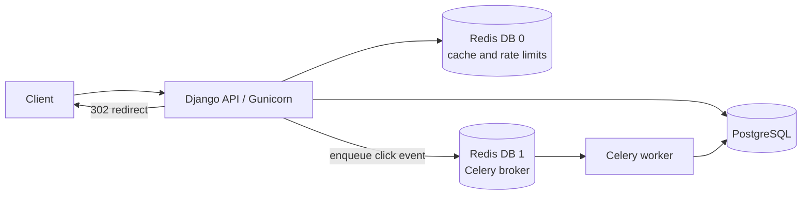

# ShortLink

A Django REST API for creating short URLs, redirecting visitors, and collecting
click analytics. The service uses PostgreSQL for persistent data, Redis for
URL caching and rate-limit counters, and Celery with Redis as a broker for
asynchronous click ingestion.

## Architecture



Short-code redirects use Redis cache-aside lookup with PostgreSQL as the source
of truth. Click events are submitted to Celery without waiting for database
ingestion to finish. URL creation is rate-limited per client IP using an
atomic Redis Lua script.

## Features

- Public URL creation and redirects, with optional accounts and owner-scoped
  URL management.
- Short-code lookup with positive and negative Redis caching. Cache failures
  fall back to the database.
- Asynchronous click ingestion, unique event IDs, User-Agent metadata
  enrichment, and an atomic database expression for click counters.
- JWT authentication and standardized API error responses.
- Fixed-window URL-creation rate limiting (100 requests per 60-second window
  by default); see [ADR-002](docs/adrs/ADR-002-sliding-window-rate-limiting.md).
- Page-number pagination for URL lists and cursor pagination for click logs.
- Health, liveness, and readiness endpoints.
- OpenAPI schema, Swagger UI, and ReDoc.

## Requirements

- Python 3.12 or newer
- Docker Compose (for PostgreSQL and Redis, or the full containerized setup)

## Run with Docker Compose

From the backend directory:

```powershell
Copy-Item .env.example .env
docker compose up --build -d
```

This starts PostgreSQL, Redis, the web service, and a Celery worker. The API is
available at `http://localhost:8000`. Check dependency readiness at
`http://localhost:8000/health/readiness/`.

To stop the services:

```powershell
docker compose down
```

## Run locally on Windows

Create the local environment file, then start PostgreSQL and Redis in
containers:

```powershell
Copy-Item .env.example .env
docker compose up -d db redis
```

Create and activate a virtual environment, then install development
dependencies:

```powershell
py -3.12 -m venv venv
.\venv\Scripts\Activate.ps1
python -m pip install -r requirements\dev.txt
```

For a host-run Django process, configure `DATABASE_URL` to connect to
`127.0.0.1:5433` and `REDIS_URL` to `redis://127.0.0.1:6379/0` in `.env`.
Set `CELERY_BROKER_URL` to `redis://127.0.0.1:6379/1` for the local worker.
Then run migrations and start the worker and web server in separate terminals:

```powershell
python manage.py migrate
celery -A config worker -l info -P solo
python manage.py runserver
```

The `solo` Celery pool is useful for local Windows development. For other
platforms, use the worker pool appropriate to the deployment environment.

## API

| Method | Endpoint | Description | Access |
| --- | --- | --- | --- |
| `POST` | `/api/auth/register/` | Register an account | Public |
| `POST` | `/api/auth/login/` | Obtain JWT tokens | Public |
| `POST` | `/api/auth/refresh/` | Refresh a JWT access token | Public |
| `POST` | `/api/urls/` | Create a short URL; custom codes are optional | Public; rate-limited |
| `GET` | `/api/urls/` | List the authenticated user's URLs | JWT |
| `GET` | `/api/urls/{short_code}/` | Retrieve URL details | Owner JWT |
| `PATCH` | `/api/urls/{short_code}/` | Update a URL | Owner JWT |
| `DELETE` | `/api/urls/{short_code}/` | Deactivate a URL (204 response) | Owner JWT |
| `GET` | `/api/urls/{short_code}/analytics/` | Aggregated click analytics | Owner JWT |
| `GET` | `/api/urls/{short_code}/clicks/` | Cursor-paginated click records | Owner JWT |
| `GET` | `/api/analytics/overview/` | Account-level analytics | JWT |
| `GET` | `/{short_code}` | Redirect to the destination | Public |
| `GET` | `/health/` | Dependency health details | Public |
| `GET` | `/health/liveness/` | Process liveness probe | Public |
| `GET` | `/health/readiness/` | Database and Redis readiness probe | Public |

JWT-protected endpoints accept `Authorization: Bearer <access-token>`.
URL-list responses use page-number pagination (`page` and `page_size`);
click-log responses use cursor pagination (`cursor` and `page_size`).
The maximum page size is 100 by default. OpenAPI and interactive API docs are
available at `/api/schema/`, `/api/docs/`, and `/api/redoc/`.

## Configuration

Use `.env.example` as the local configuration template. Important settings
include:

| Variable | Purpose |
| --- | --- |
| `DJANGO_SECRET_KEY` | Django signing key; replace the example value outside local development |
| `DJANGO_DEBUG` | Enables Django debug mode |
| `DJANGO_ALLOWED_HOSTS` | Comma-separated allowed host names |
| `DATABASE_URL` | PostgreSQL connection URL |
| `REDIS_URL` | Redis URL for cache and rate-limit data (database 0 by default) |
| `CELERY_BROKER_URL` | Celery broker URL (Redis database 1 by default) |
| `BASE_SHORT_URL` | Base URL used when constructing short-link URLs |
| `CODE_LENGTH` | Length for generated short codes |

Docker Compose overrides database and Redis hostnames for container-to-container
connections.

## Rate limiting and telemetry notes

Rate limiting is currently a fixed window aligned to 60-second epoch
boundaries, not a sliding-window counter. Redis runs the increment and expiry
atomically. Redis errors are configured to fail open by default, so URL
creation remains available while rate-limit enforcement is unavailable.

Redirects enqueue click events to Celery and return without waiting for the
database write. The worker retries failures up to three times and logs final
failures; the current code does not implement a durable dead-letter queue.
Click ingestion is eventually consistent, and enqueue/worker failures can mean
an event is not reflected in analytics. See [ADR-001](docs/adrs/ADR-001-async-telemetry-ingestion.md).

## Security posture

- API URL validation allows HTTP and HTTPS and checks hostnames against
  loopback, private, link-local, reserved, multicast, and unspecified IP
  addresses.
- URL management and analytics queries are scoped to the authenticated owner;
  non-owned links are reported as not found.
- Production settings disable debug mode, enforce HTTPS redirection, set secure
  cookie options, configure HSTS, and deny framing.
- Proxy-aware client IP parsing is configurable. Configure trusted proxy count
  correctly before relying on forwarded IPs for rate limiting.

These are implementation notes, not a security audit or guarantee. Review
deployment-specific proxy, TLS, secrets, and network controls before
production use.

## Tests and API schema validation

Run the test suite with its configured coverage threshold:

```powershell
pytest -v
```

Validate the generated OpenAPI schema and treat warnings as failures:

```powershell
python manage.py spectacular --validate --fail-on-warn
```

The Locust scenario is in `loadtests/locustfile.py`. It exercises hot and cold
redirects and URL creation; it is a load-test script, not a published
benchmark. Results depend on the environment and should be measured and
reported with the runtime, data set, and load profile.

## Architecture decision records

- [ADR-001: Asynchronous click ingestion](docs/adrs/ADR-001-async-telemetry-ingestion.md)
- [ADR-002: Fixed-window rate limiting](docs/adrs/ADR-002-sliding-window-rate-limiting.md)
- [ADR-003: Cursor pagination for click streams](docs/adrs/ADR-003-cursor-pagination-for-clickstreams.md)
